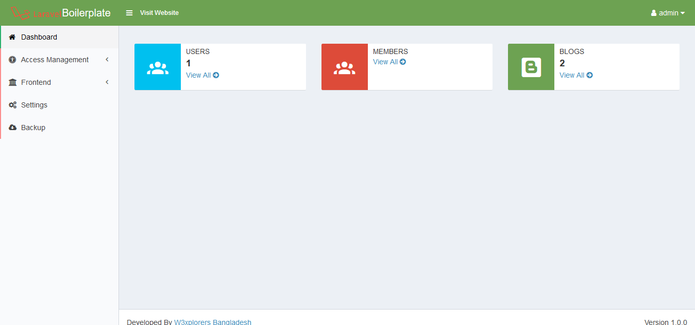
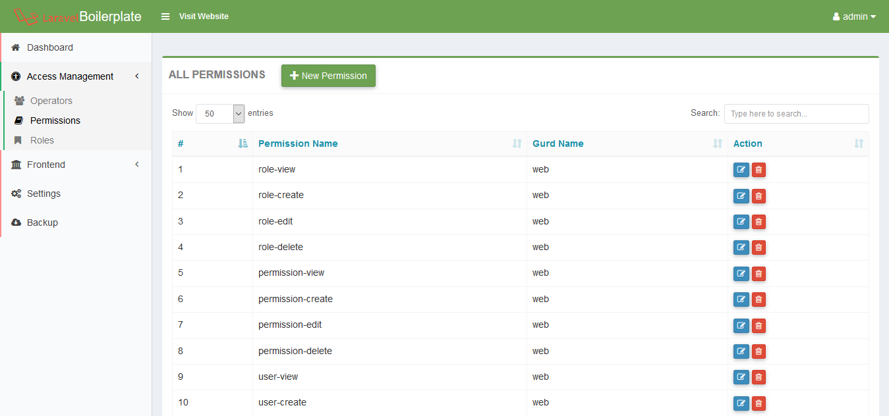
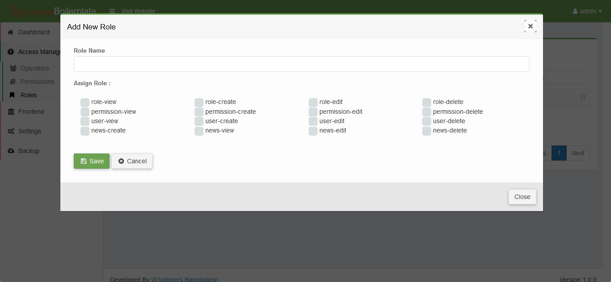
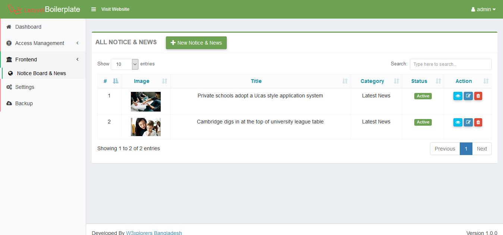
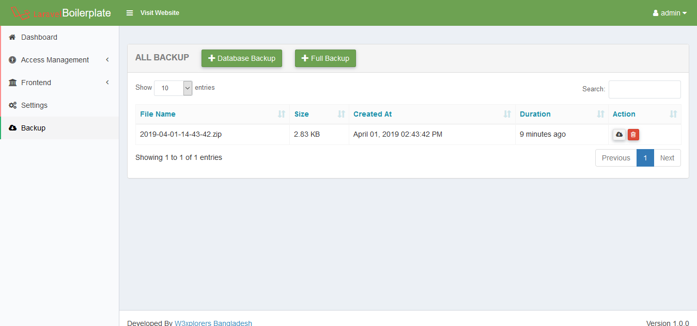
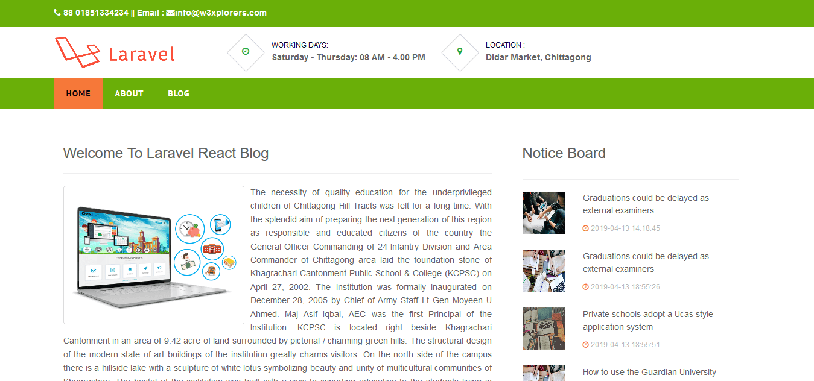
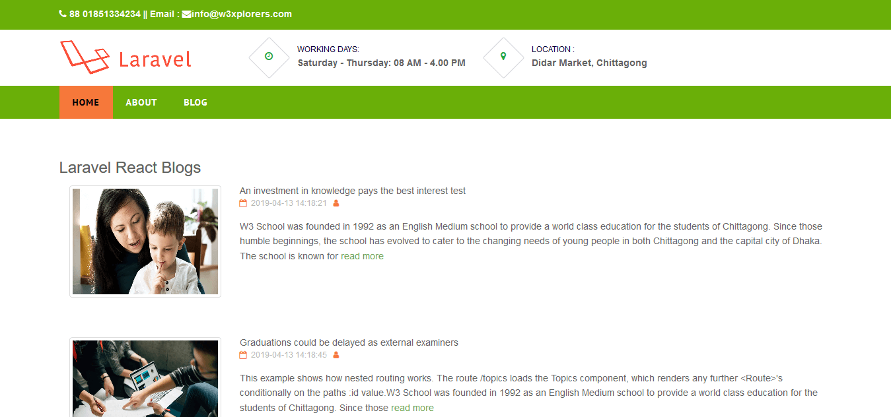
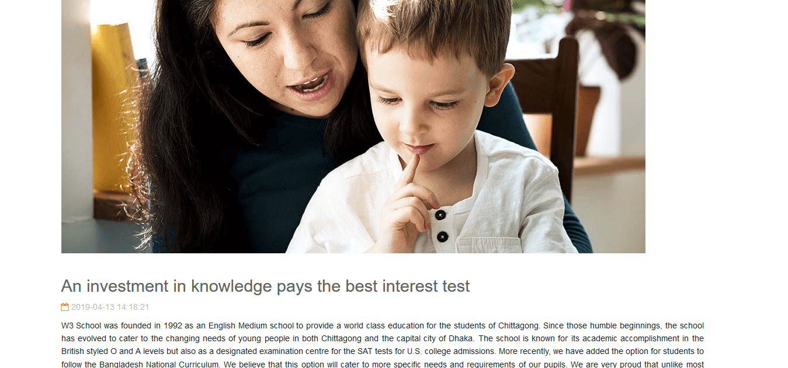

# Simple blog application using react js with laravel api

## Features

    1. Laravel 5.8 Framework
    2. Laravel-Permission by spatie/laravel-permission
    3. Laravel Backup by spatie/laravel-backup
    4. Yajra Datatable by Yajra
    5. Laravel Ajax CRUD
    6. React js Fronend
    7. Axios
    8. React Pagination

### Requirements

    1. PHP version upto 7.2    
    2. Laravel version  5.8   

### Installation

    1. Clone the project using git clone   
    2. Copy a fresh .env file from laravel github    
    3. Update .env file by adding database information like DB_HOST.  
    4. Go to project root folder.Open git bash or terminal and run  composer install       
    5. Run php artisan key:generate in the terminal    
    6. Run php artisan migrate  
    7. npm install
    8. npm run dev
    
### Seeder Class
    1. php artisan db:seed   to seed all seeder  
      
    
### Troubleshootings
    
    All Models are in App/Models folder
    
    1. Add 'model' => App\Models\User::class, in config/auth.php providers
    2. Change Db port in config/database.php file or change as yours.
    3. Try composer composer dump-autoload if need
    4. php artisan config:cache if need
    5. php artisan clear-compiled if need    
    
### Note*
    
    Don't delete or edit already added permissions to avoid error   
    
         
### Login
         
         email : admin@admin.com
         pass :  123456
    
Screenshot : 

 Find me on  Linkedin  : [My Linkedin profile  link](https://www.linkedin.com/in/monjur-morshed-riyadh-6aaba465/)  \
 Email me : riyadhahmed777@gmail.com